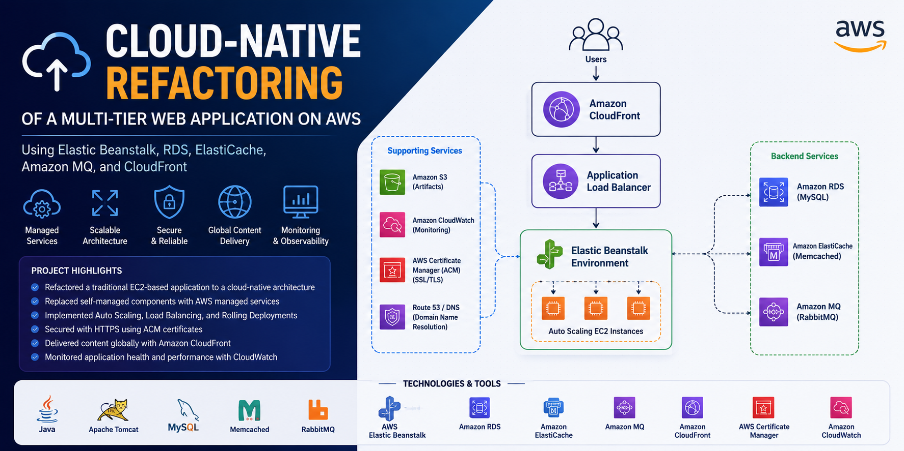
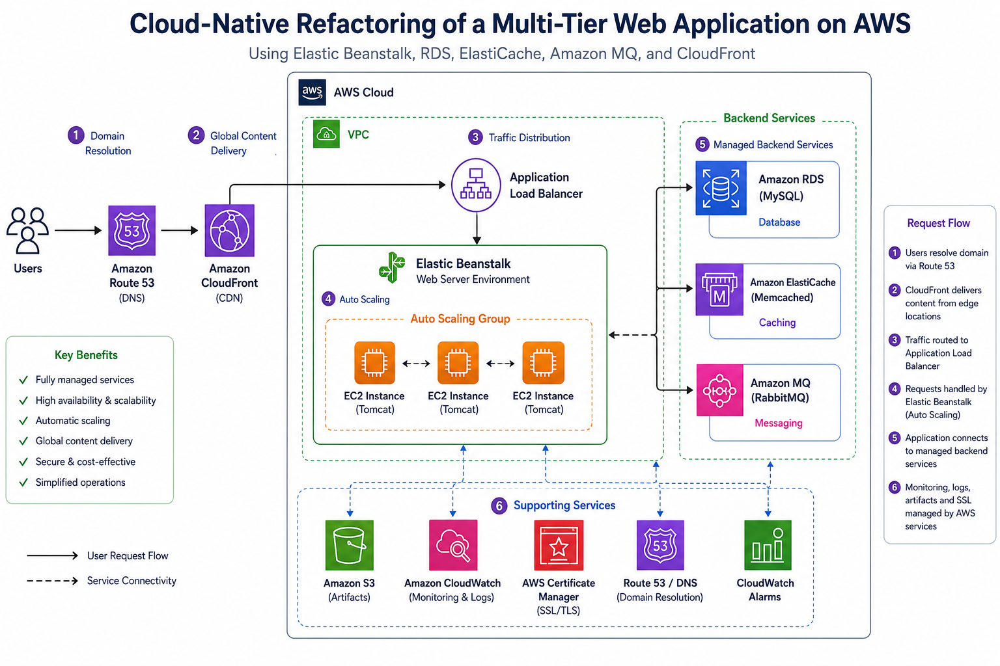

# Cloud-Native Refactoring of a Multi-Tier Web Application on AWS Using Elastic Beanstalk, RDS, ElastiCache, Amazon MQ, and CloudFront



## Overview

This project demonstrates the refactoring and modernisation of a traditional multi-tier Java web application (VProfile) into a cloud-native architecture using AWS managed services.

The original application relied on self-managed infrastructure components running on EC2 instances. In this project, these components were replaced with AWS Platform-as-a-Service (PaaS) offerings to improve scalability, availability, operational efficiency, security, and maintainability.

The solution leverages AWS Elastic Beanstalk, Amazon RDS, Amazon ElastiCache, Amazon MQ, Application Load Balancer, Auto Scaling, AWS Certificate Manager (ACM), and Amazon CloudFront to deliver a highly available, scalable, and globally accessible application platform.

---

## Project Objectives

* Refactor a traditional multi-tier application into a cloud-native architecture.
* Reduce infrastructure management overhead.
* Improve scalability and availability.
* Implement managed database, caching, and messaging services.
* Automate application deployment using Elastic Beanstalk.
* Secure the application using HTTPS and SSL/TLS certificates.
* Deliver content globally using Amazon CloudFront.

---

## Architecture




---

## AWS Services Used

| Service                        | Purpose                                           |
| ------------------------------ | ------------------------------------------------- |
| Elastic Beanstalk              | Application deployment and management             |
| EC2                            | Underlying compute instances managed by Beanstalk |
| Application Load Balancer      | Traffic distribution                              |
| Auto Scaling Group             | Automatic scaling                                 |
| Amazon RDS (MySQL)             | Managed relational database                       |
| Amazon ElastiCache (Memcached) | Distributed caching                               |
| Amazon MQ (RabbitMQ)           | Managed message broker                            |
| Amazon S3                      | Application artifact storage                      |
| Amazon CloudWatch              | Monitoring and health reporting                   |
| AWS Certificate Manager (ACM)  | SSL/TLS certificate management                    |
| Amazon CloudFront              | Global content delivery network                   |
| Route 53 / DNS Provider        | Domain name resolution                            |

---

## Architecture Evolution

### Before Refactoring

```text
Users
   │
   ▼
Load Balancer
   │
   ▼
EC2 (Tomcat)
   │
   ├── EC2 (MySQL)
   ├── EC2 (Memcached)
   └── EC2 (RabbitMQ)
```

### After Refactoring

```text
Users
   │
   ▼
CloudFront
   │
   ▼
Application Load Balancer
   │
   ▼
Elastic Beanstalk
   │
   ├── Amazon RDS
   ├── Amazon ElastiCache
   └── Amazon MQ
```

---

## Key Features

* Managed application hosting with Elastic Beanstalk
* Automated deployments
* Rolling deployment strategy
* Auto Scaling and Load Balancing
* Managed MySQL database
* Managed Memcached cache
* Managed RabbitMQ messaging
* HTTPS with ACM certificates
* Global CDN with CloudFront
* Enhanced monitoring through CloudWatch
* Security Group-based access control
* High availability architecture

---

## Deployment Workflow

📖 Detailed step-by-step deployment procedures, configuration details, and workflow documentation are available in the [Setup Guide](./Setup-Guide.md).

1. Create Backend Security Group
2. Create EC2 Key Pair
3. Deploy Amazon RDS MySQL
4. Deploy Amazon ElastiCache Memcached
5. Deploy Amazon MQ RabbitMQ
6. Initialise Database Schema
7. Create Elastic Beanstalk IAM Roles
8. Deploy Elastic Beanstalk Environment
9. Configure Security Group Access
10. Build Application Artifact
11. Deploy WAR File to Elastic Beanstalk
12. Configure HTTPS Listener
13. Configure DNS Records
14. Create CloudFront Distribution
15. Associate Custom Domain and ACM Certificate
16. Validate Application Functionality
17. Verify CloudFront Caching

---

## Build and Deployment

### Clone Repository

```bash
git clone https://github.com/OlumideOlumayegun/cloud-native-refactoring-of-web-app.git
cd cloud-native-refactoring-of-web-app
```

### Build Artifact

```bash
mvn clean install
```

Generated artifact:

```text
target/vprofile-v2.war
```

### Deploy

Upload the WAR file to Elastic Beanstalk using:

```text
Elastic Beanstalk → Upload and Deploy
```

---

## Security Considerations

* Backend services deployed in private subnets/security groups
* Amazon RDS configured without public access
* Amazon MQ configured with private access
* HTTPS enabled using ACM certificates
* CloudFront used as the public entry point
* Security Groups enforce least-privilege communication

---

## Validation

Successful deployment is verified through:

* Application login page accessibility
* Database connectivity
* RabbitMQ connectivity
* Memcached connectivity
* HTTPS certificate validation
* CloudFront response headers

CloudFront verification:

```text
Browser Developer Tools
→ Network
→ Headers
→ Via: cloudfront.net
```

---

## Skills Demonstrated

### DevOps

* AWS Infrastructure Provisioning
* Cloud Architecture
* Infrastructure Modernisation
* Auto Scaling
* Load Balancing
* Application Deployment
* Monitoring and Logging
* DNS Management
* SSL/TLS Configuration

### Cloud Services

* Elastic Beanstalk
* Amazon RDS
* Amazon ElastiCache
* Amazon MQ
* Amazon CloudFront
* AWS Certificate Manager
* Amazon CloudWatch

### Application Delivery

* Rolling Deployments
* Zero/Low Downtime Deployments
* Cloud-Native Design
* CDN Integration
* Secure Web Application Delivery

---

## Future Enhancements

* Infrastructure as Code using Terraform
* CI/CD Pipeline using GitHub Actions
* Containerisation with Docker
* Kubernetes deployment using Amazon EKS
* Blue/Green deployments
* AWS WAF integration
* AWS Secrets Manager integration
* Route 53 hosted zones and automated DNS management

---

## Author

**Olumide Olumayegun**

DevOps Engineer | Data Scientist | AI Application Developer

**Bridging DevOps, Data Science, and AI – From Deployment Pipelines to Deep Insights**

---